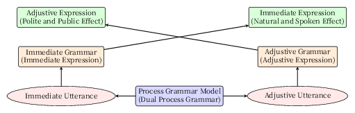

### 襷掛け効果（Tasuki-gake Effect）

即時文法と調整文法は、通常はそれぞれ異なる文脈で使われる。

- 即時文法は、日常会話や状況依存の発話など、即興的かつ自然な文脈で用いられる。
- 調整文法は、文章化された発表・手紙・スピーチ原稿・あいさつなど、あらかじめ構成された文脈で用いられる。

しかし、これらが**交差して使われる**とき、特有の表現効果が現れる。これを「襷掛け効果（たすきがけこうか）」と呼ぶ。

- 即時文法が調整文法的文脈（小説、演説、論評など）に使われると、表現にスピード感・臨場感・自然さが加わり、生き生きとした印象を与える。
- 調整文法が即時的文脈（会話、やりとり、返答など）で使われると、丁寧さ・慎重さ・あらたまった印象が付加され、儀礼的・公的な効果が現れる。

このように、文法と文脈の交差によって、それぞれ本来の枠を超えた表現効果が生じる現象を「襷掛け効果」と定義する。
